# Timely.AI — Intelligent Academic Timetable Scheduling System
> *An AI-powered academic scheduling platform combining Flutter, reactive state management (Riverpod), and Google OR-Tools CP-SAT discrete optimization to automate conflict-free timetable generation.*

---

## 📌 Portfolio Overview (Apple Developer Academy Showcase)

### 1. One-to-Two Sentence Summary
**Timely.AI** is an intelligent scheduling application built with Flutter and Python that transforms the tedious, multi-day task of academic timetable generation into an instantaneous, conflict-free automated process using constraint satisfaction algorithms (Google OR-Tools CP-SAT) paired with an intuitive, dark-mode mobile interface and on-device PDF compilation.

### 2. Project Classification
- **Type**: Self-Initiated Project (Academic Logistical Solution)
- **Nature**: Individual Full-Stack & Algorithm Project
- **Core Disciplines**: Mobile UI/UX Design (Flutter/Dart), Operations Research & AI (Google OR-Tools CP-SAT, Python Flask), Reactive State Architecture (Riverpod), and Document Generation (PDF/Printing).

### 3. Impact Made
- **Conflict-Free Guarantee**: Solved the NP-hard combinatorial problem of scheduling multiple faculties, courses, venues, and student cohorts with zero hard-constraint overlaps (faculty availability, room capacities, lab types, consecutive hours).
- **Time Savings**: Slashed schedule preparation time from days of manual trial-and-error to sub-second mathematical solving.
- **Granular Availability Modeling**: Designed interactive weekly time-slot grids allowing instructors and facilities to define custom availability windows and blackout periods.
- **Hierarchical Cohort & Lab Pairing**: Supported complex academic rules such as preferred lecture halls, dedicated computer/hardware labs, fallback time windows, and multi-instructor course qualification.
- **Real-World Institutional PDF Delivery**: Implemented pixel-perfect PDF export formatted specifically for university administration (Malnad College of Engineering layout) with complete subject legends, faculty allocations, and print integration.

### 4. Key Learnings & Growth
- **Advanced State Management**: Structured comprehensive global state via Flutter Riverpod, seamlessly synchronizing complex relational data (Instructors, Courses, Rooms, Cohorts, and Constraints).
- **Constraint Satisfaction Problem (CSP) Formulation**: Translated real-world academic rules into mathematical boolean and integer expressions (Interval Variables, Non-overlapping constraints, and Cumulative resources) executed by Google OR-Tools CP-SAT.
- **Human-Centered Mobile Interface**: Designed an intuitive, high-contrast dark mode UI tailored for complex data entry, featuring tactile weekly time matrices, multi-select faculty pickers, and clear visual hierarchy.
- **Robust Client-Server Architecture**: Built a resilient REST communication layer with detailed solver telemetry, diagnosing over-constrained inputs with actionable bottleneck hints.

---

## 🌟 Academy Evaluation Pillars

| Academy Value | How Timely.AI Demonstrates It |
| :--- | :--- |
| **🔥 Interest & Motivation** | Driven by real-world university scheduling bottlenecks, investing deep engineering across both algorithm theory and mobile application design. |
| **🎨 Creativity & Expression** | Transformed complex, dry tabular logistics into an engaging, tactile mobile experience featuring custom weekly availability matrices, neon-accented card layouts, and responsive dark aesthetics. |
| **🧠 Interdisciplinary Potential** | Harmonized Operations Research (mathematical discrete optimization) with modern cross-platform mobile engineering and human-centered interaction design. |
| **⚡ Work Ethic & Excellence** | Delivered a complete, end-to-end workflow: from data input, weekly availability matrices, and multi-faculty course assignments to AI solving, manual tweaking, and official institutional PDF generation. |

---

## 📸 Comprehensive Step-by-Step Walkthrough

### Phase 1: Resource Modeling & Infrastructure

#### Step 1: Central Dashboard & Entity Health
*The home screen provides at-a-glance monitoring of academic entities (Instructors, Courses, Rooms, Student Groups) with status tracking and clean navigation cards.*

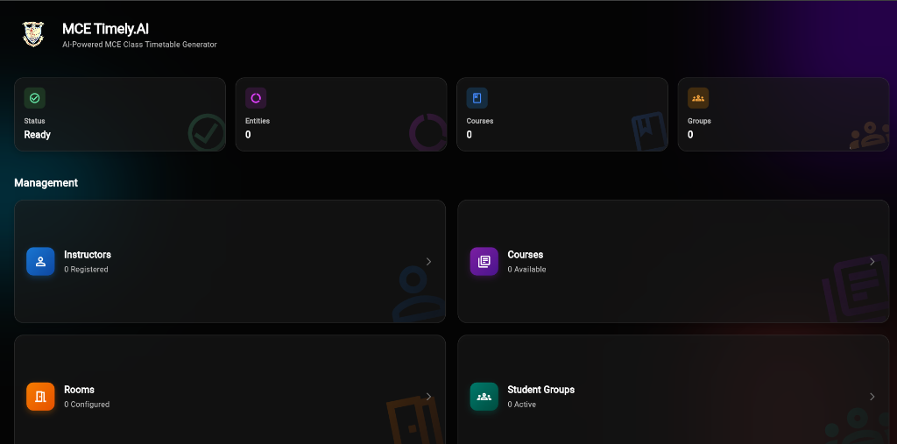
*Fig 1: MCE Timely.AI main dashboard featuring live entity counters and quick management hubs.*

---

#### Step 2: Instructor Registry Management
*A centralized roster displaying all registered faculty members with their unique institutional IDs and direct access to modification tools.*

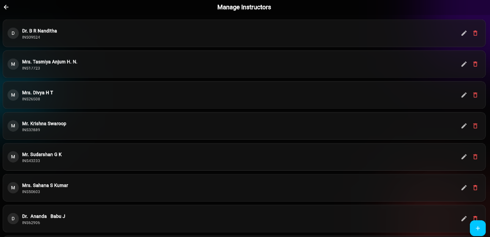
*Fig 2: Faculty management console displaying registered instructors with instant edit and removal actions.*

---

#### Step 3: Interactive Weekly Availability Matrix
*Rather than simple text inputs, instructors' availability is captured using a tactile weekly grid (Monday through Saturday, 08:30 AM to 04:00 PM). Administrators can tap time slots to mark preferences and constraints.*

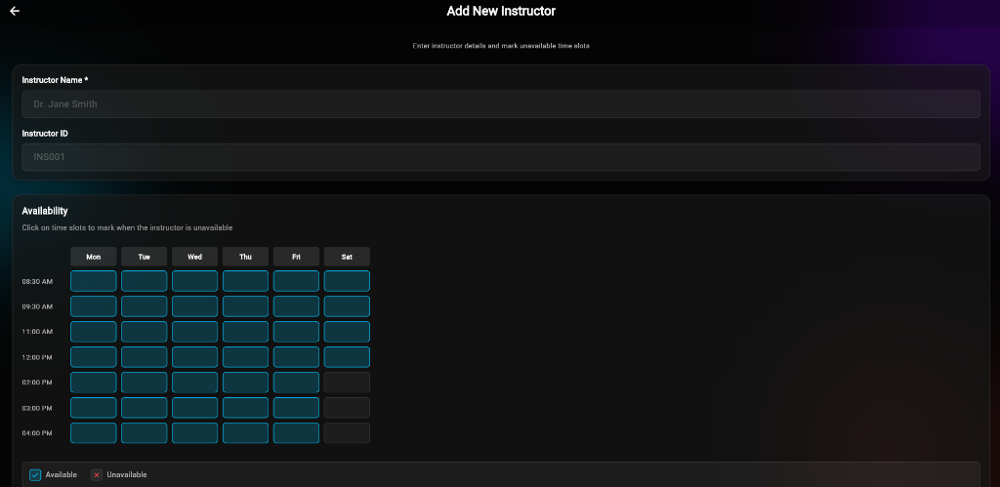
*Fig 3: Interactive availability matrix showing time slots and Saturday afternoon blackout periods.*

---

#### Step 4: Comprehensive Course Configuration & Faculty Mapping
*Courses are modeled with complete academic rigor: Course Code, Lecture vs. Lab Hours, Lab Types (e.g., Computer Lab), Credits, L-T-P distribution (e.g., 3-0-2), and eligible instructor assignments.*

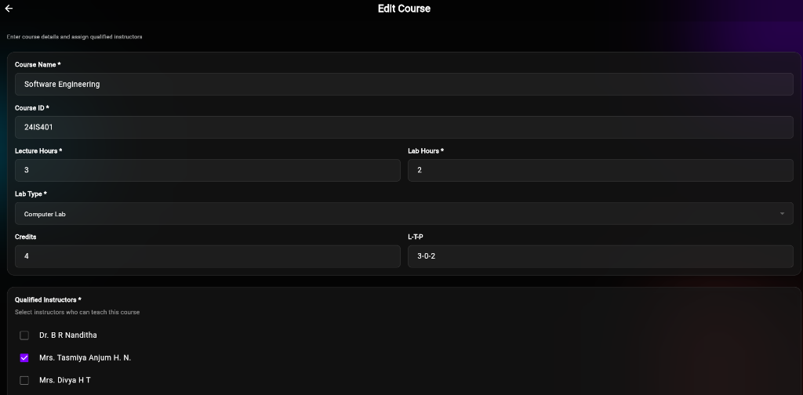
*Fig 4: Course setup screen with credit breakdown, lab requirements, and qualified faculty mapping.*

---

#### Step 5: Room & Venue Infrastructure Management
*Administrators configure all available campus spaces, differentiating between standard lecture halls, computer labs, and hardware labs with designated student capacities.*

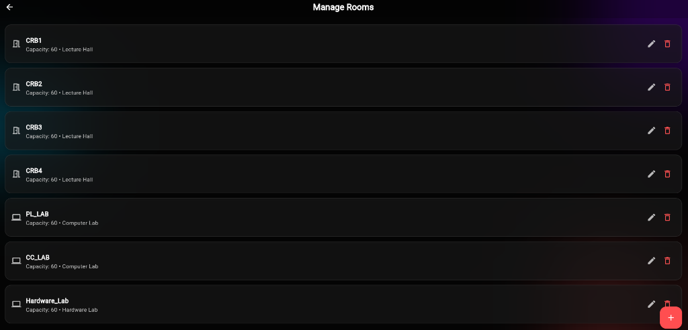
*Fig 5: Campus venue registry listing lecture halls (CRB1–4) and specialized laboratories (PL_LAB, CC_LAB, Hardware_Lab).*

---

#### Step 6: Room Capacity, Equipment & Availability Matrix
*Each venue can specify supported equipment tags (e.g., Projectors, Workstations) and an independent weekly availability matrix to account for maintenance or department sharing.*

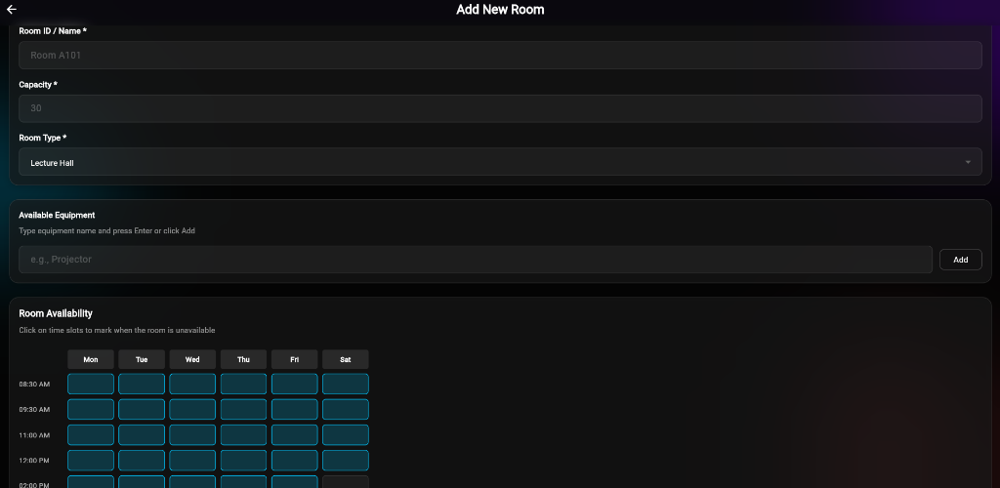
*Fig 6: Room configuration screen with capacity limits, equipment tags, and weekly blackout matrices.*

---

### Phase 2: Student Cohorts, Preferences & Constraint Rules

#### Step 7: Student Cohort & Section Management
*Overview of all academic batches (e.g., 23ISA, 23ISB, 24ISA, 24ISB, 24ISC) along with their batch size and enrolled course load.*

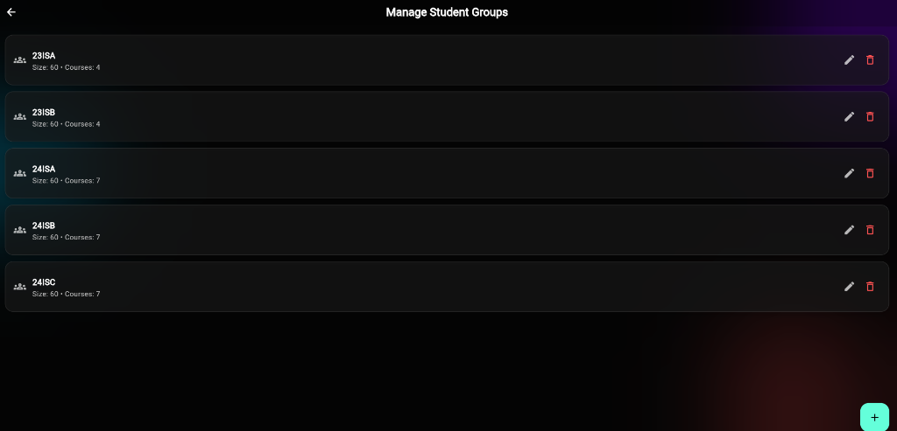
*Fig 7: Cohort management console showing active sections, enrolled courses, and student capacities.*

---

#### Step 8: Cohort Enrollment & Preferred Common Rooms
*Configure specific batch details including class strength, preferred home lecture hall (to minimize student travel between periods), and enrolled course selection.*

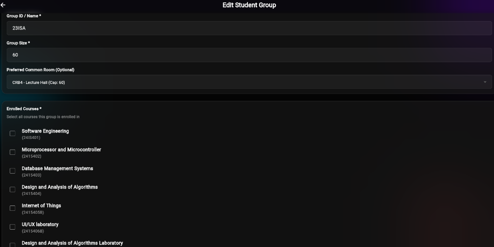
*Fig 8: Section enrollment screen showing batch size, preferred lecture hall (CRB4), and course checklists.*

---

#### Step 9: Fine-Grained Section Course & Lab Allocation
*Link each enrolled course for a cohort to dedicated instructors, specific laboratory spaces, and timing preferences (e.g., Afternoon Fallback).*

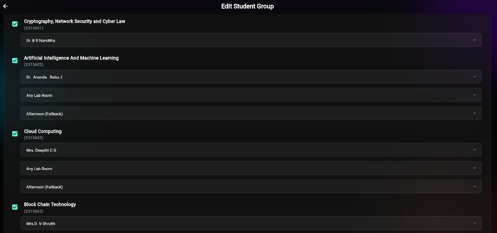
*Fig 9: Granular course-to-instructor mapping with custom lab venue preferences and scheduling fallbacks.*

---

#### Step 10: Solver Settings & Soft Constraint Optimization
*Fine-tune AI solving heuristics: minimize idle gaps for students via weighted priority sliders, enforce fair faculty workload distribution, and declare preferred morning theory courses.*

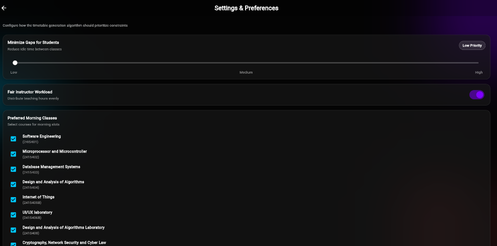
*Fig 10: Algorithmic tuning panel defining soft constraints, student gap minimization, and morning class preferences.*

---

#### Step 11: Control Dock & AI Engine Trigger
*The primary action dock allows administrators to backup institutional datasets, inspect generation rules, view past timetable archives, and execute the AI optimization engine.*

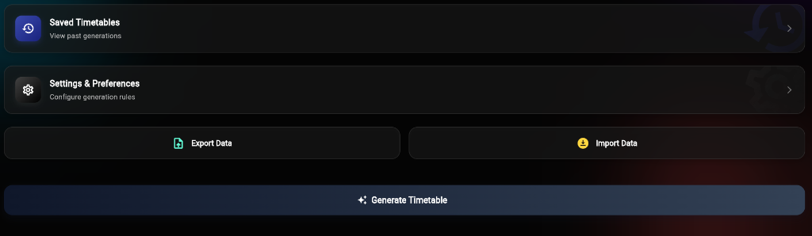
*Fig 11: Control dock featuring Data Export/Import, Saved Timetables, Settings, and the AI Generation trigger.*

---

### Phase 3: Timetable Visualization & Institutional Delivery

#### Step 12: Multi-Perspective Schedule Filtering
*The generated schedule can be sliced dynamically by Student Group, Faculty Member, or Specific Classroom to verify allocations across perspectives.*

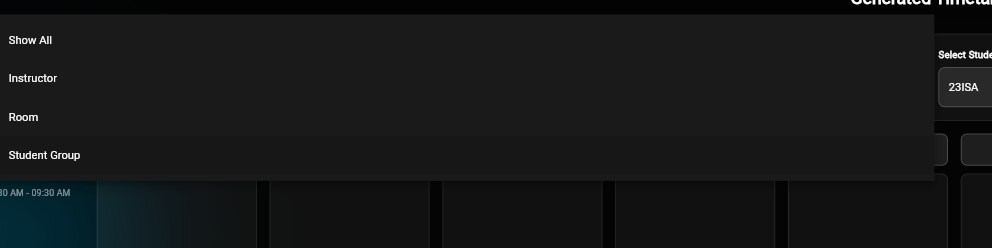
*Fig 12: Contextual filter allowing inspection by Cohort, Faculty Member, or Room.*

---

#### Step 13: Conflict-Free Generated Timetable Grid
*Interactive calendar view featuring color-coded course blocks displaying course title, instructor, venue, and cohort with inline controls to edit and export.*

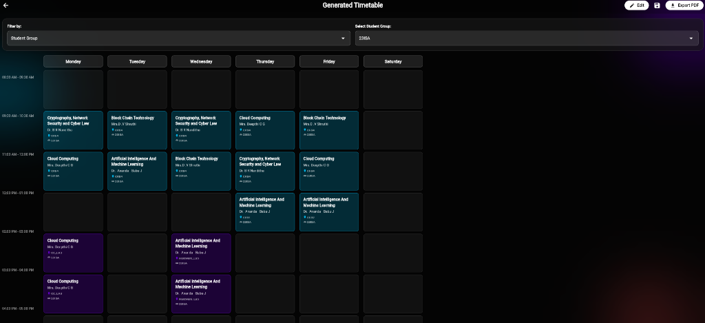
*Fig 13: Generated weekly schedule matrix for Section 23ISA with clean visual categorization and zero conflicts.*

---

#### Step 14: Official Institutional PDF Document Compilation
*One-tap generation of official university-formatted timetable documents (Malnad College of Engineering standard), including full L-T-P breakdown, faculty designations, and direct print/PDF export.*

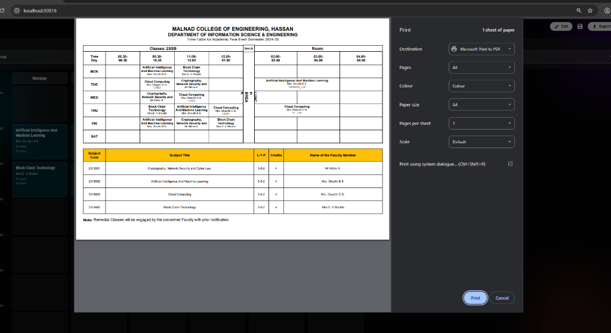
*Fig 14: Publication-ready timetable PDF formatted for official academic posting and administrative sign-off.*

---

## 🏗️ System Architecture & Tech Stack

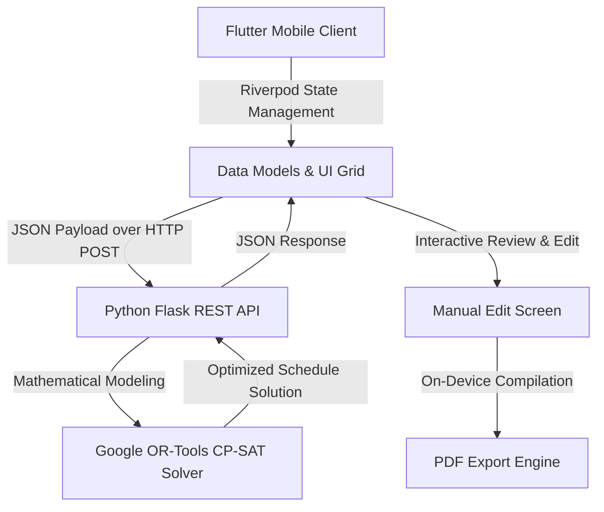

- **Frontend**: Flutter (Dart)
  - State Management: `flutter_riverpod`
  - PDF Generation & Printing: `pdf`, `printing`
  - Local Storage & Serialization: `shared_preferences`, `intl`
- **Backend Engine**: Python 3
  - Framework: Flask, Flask-CORS
  - Optimization Solver: Google OR-Tools (Constraint Programming - SAT)
  - Diagnostics: Real-time constraint logging and bottleneck diagnostics

---

## 🚀 How to Run the Project Locally

### 1. Start the Optimization Backend
```powershell
cd server
.\Timely_venv\Scripts\Activate.ps1
python app.py
```
*Server runs by default on `http://0.0.0.0:5000`.*

### 2. Launch the Flutter App
Ensure the server IP address is configured in `timetable_repository.dart` for your target environment:
```powershell
cd front-end/timely_ai
flutter run
```

---

## 📬 Portfolio Submission Details
- **Project**: Timely.AI (Academic Timetable Optimization System)
- **Target Program**: Apple Developer Academy Indonesia
- **Suggested PDF Name**: `Yashwanth_Portfolio_Academy.pdf`
